# 知乎请求头参数 x-zse-96 逆向思路

## 一、背景与目标

`x-zse-96` 是知乎搜索接口请求头中的一个加密参数，属于知乎反爬虫签名校验的一部分。请求头中同时存在 `x-zse-93`（版本号）与 `x-zse-96`（签名值），其中 `x-zse-96` 是由一段加密算法动态生成的签名，用于服务端校验请求的合法性。

本文记录通过浏览器开发者工具（DevTools）对 `x-zse-96` 参数进行逆向分析、定位加密逻辑并最终还原算法的完整思路。

**涉及工具**：

- 浏览器开发者工具（DevTools）
- curlConverter（curl 转代码 / 请求解析工具）
- Node.js 环境（用于本地运行抠出的 JS 代码并补环境验证）

## 二、定位加密参数

结合第三方工具 curlConverter 可以看出，`x-zse-96` 是请求头中的一个加密参数，其值是一串密文，并不是明文，因此需要进一步定位其加密位置。

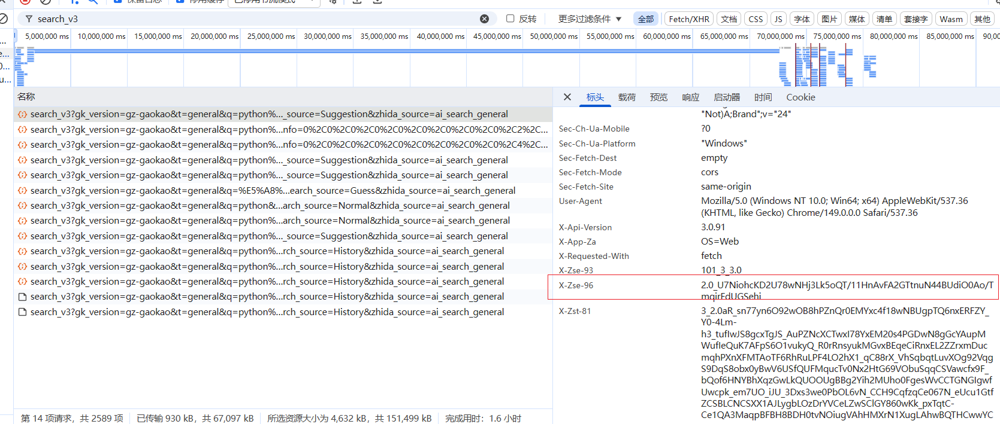

## 三、使用 XHR 断点定位加密位置

由于该参数是在请求头中携带，属于 XHR（XMLHttpRequest）请求范畴，因此采用 **XHR 断点** 的方式进行加密位置的定位。

在 Sources 面板的 XHR/fetch Breakpoints 中添加断点，拦截搜索相关的请求。

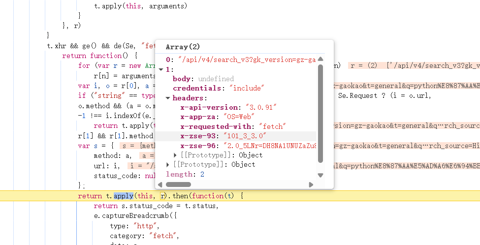

在搜索输入框中输入关键词并回车，触发搜索请求，此时可以定位到发送请求的位置。可以看到请求头中的 `x-zse-96` 参数此时已经被加密完成，说明加密逻辑在此之前已经执行完毕，因此需要沿着调用堆栈（Call Stack）向上回溯调试。

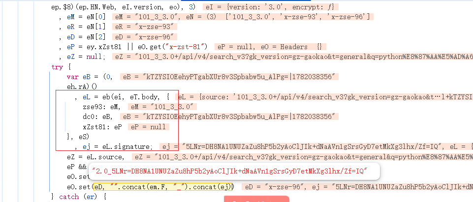

## 四、调用堆栈回溯定位核心加密逻辑

沿着调用堆栈逐步向上回溯，最终定位到 `x-zse-96` 的加密核心位置：该值是由 `ej` 生成的。重点关注 `eL` 的值，随后进入 `eb` 函数查看具体的加密实现。

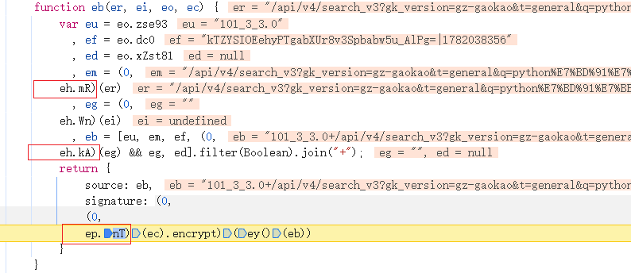

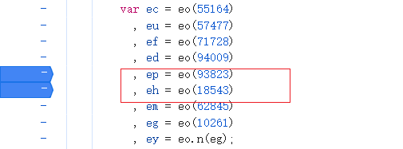

## 五、识别 Webpack 打包结构

继续观察可以发现 `eh`、`ep` 是 **webpack 加载器模块打包** 的方式。逆向经验提示：当看到类似 `对象.函数(参数)` 这种调用形式时，就要联想到 webpack 模块打包。

此时需要在 `ep` 或 `eh` 任意一个的前面加上断点，然后重新刷新页面（`Ctrl + Shift + R`，强制刷新）。因为加载器是在页面首次刷新的时候进行加载的，所以可以在此断住。

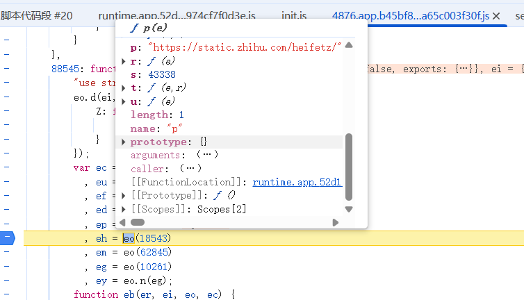

随后进入到 `eo` 这个加载器中。

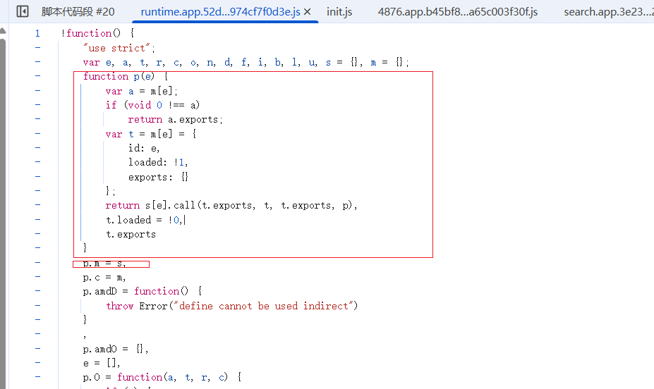

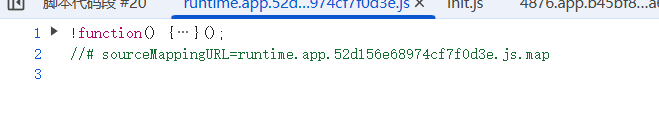

此时观察这个加载器，结合上下文可以看到这是一个 `!function(形参) { 加载器执行逻辑 }(功能模块)` 的自执行函数（IIFE）。但是注意到这里**并没有**功能模块和形参，所以需要找到整个功能模块。代码中的 `p.m = s` 表明功能模块被挂载到了 `p` 上，也就是加载器上。

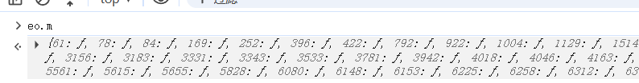

## 六、提取功能模块

在控制台（Console）中输入 `eo.m` 即可得到功能模块，并且是以字典（对象）的形式存在；再输入 `eo.m[18543]` 即可定位到当前加密所调用的函数。

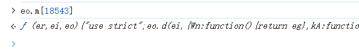

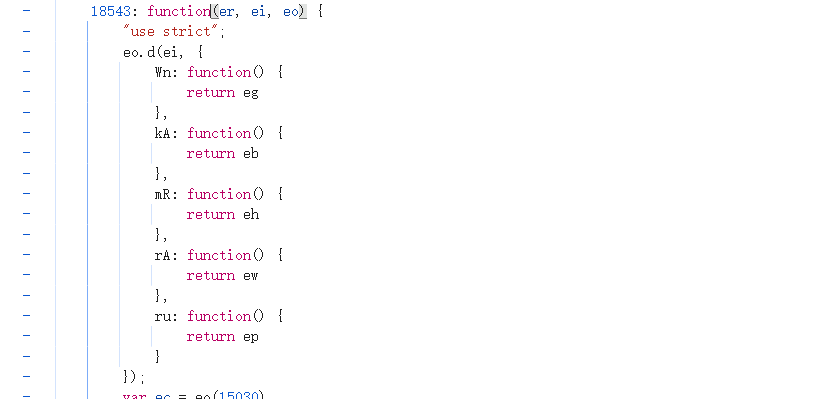

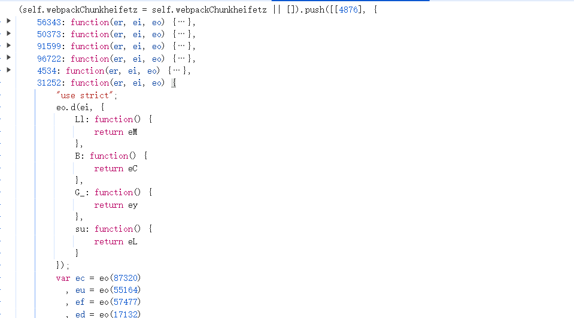

由上下文可以看到它的整个加载器功能模块。

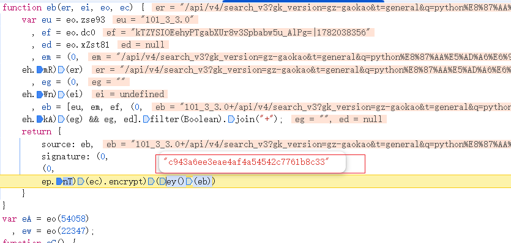

## 七、分析加密算法

对功能模块进一步分析可以发现，这里输出的结果实际上是 **MD5 摘要算法**，并且是**没有加盐**的原始形式。

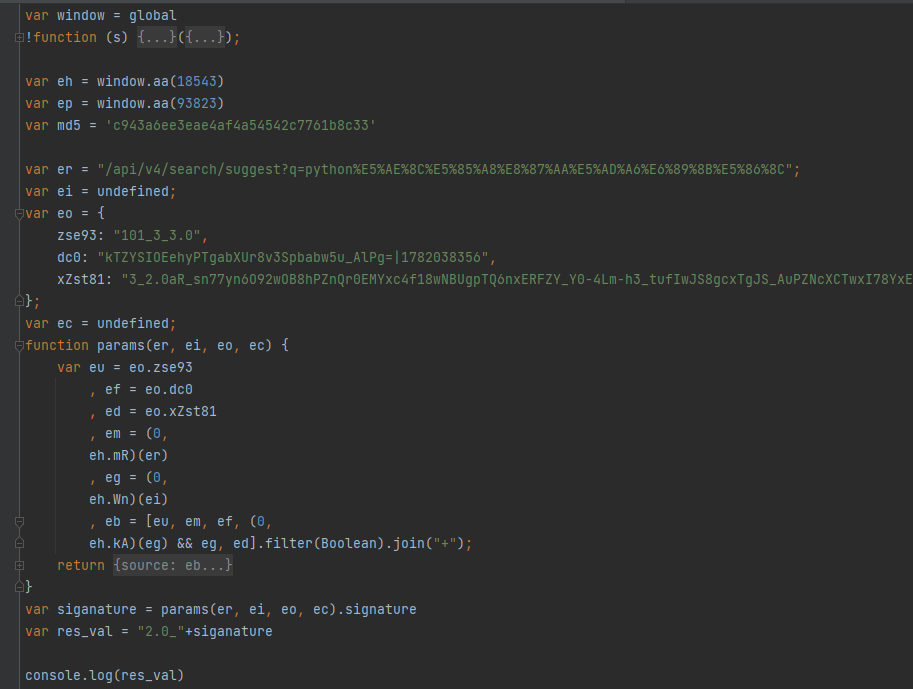

## 八、还原 JS 代码

整理 JS 代码，**抠出 webpack 加载器模块 + 补环境**，即可在本地得到 `signature` 的值，并最终得到 `x-zse-96` 的值。

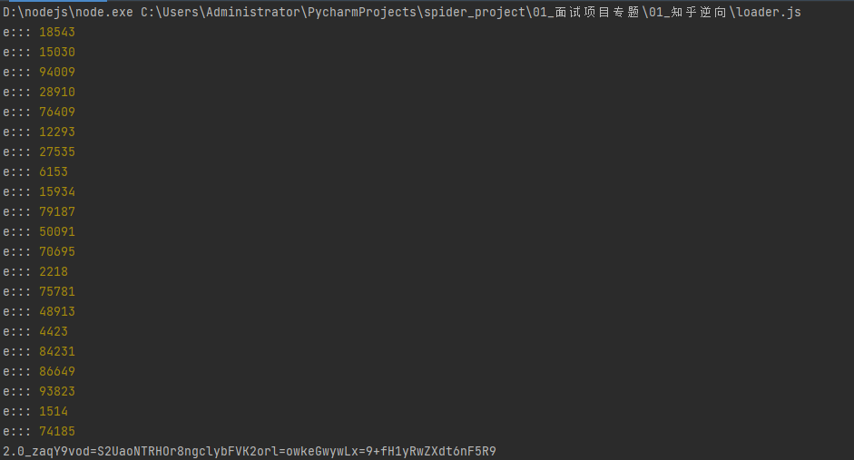

## 九、总结

整个 `x-zse-96` 参数的逆向思路可以归纳为以下几个关键步骤：

1. **定位参数**：通过 curlConverter 确认 `x-zse-96` 为请求头加密参数；
2. **XHR 断点**：通过 XHR 断点拦截请求，结合调用堆栈回溯定位加密位置；
3. **识别打包结构**：识别出 webpack 加载器模块打包方式，找到挂载功能模块的加载器；
4. **提取模块**：通过控制台提取功能模块，定位到具体加密函数；
5. **还原算法**：分析得出核心算法为无盐的 MD5 摘要，整理 JS 代码并补环境，最终复现 `x-zse-96` 的生成逻辑。

> 说明：本文仅用于技术学习与逆向思路记录，请遵守相关平台的服务条款与法律法规，勿用于任何非法用途。
